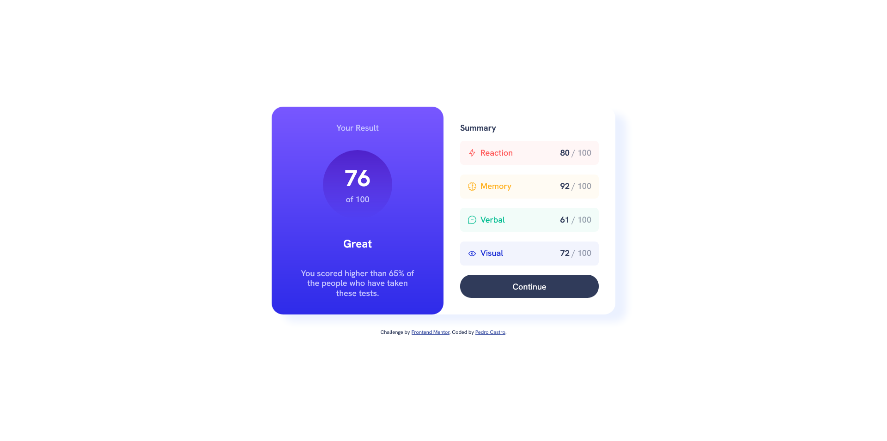

# Results Summary Component

> Status do projeto: Concluído :white_check_mark:

Essa é uma solução para o projeto [Results Summary Component](https://www.frontendmentor.io/challenges/results-summary-component-CE_K6s0maV)!

## Overview

Simples projeto para praticar HTML e CSS!

### Links

- Solução URL: [Frontend Mentor](https://www.frontendmentor.io/solutions/resultssummarycomponent-CjiCA_FKbF)
- Live Site URL: [Live](https://results-summary-component-zeta-nine.vercel.app/)

### Autor

- Frontend Mentor - [@pedrodcastro](https://www.frontendmentor.io/profile/pdaugz)

